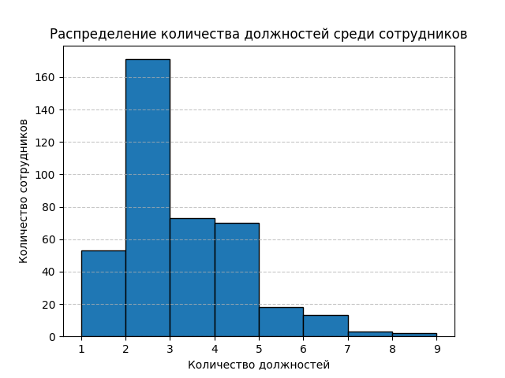

# Отчет  Лаб1

Максимов Д, Азаренков Г, Ковалев В.

## Постановка задачи
В рамках данной работы использовался метод веб-скрейпинга для извлечения информации о сотрудниках Университета ИТМО. Основные цели включали сбор данных о количестве должностей сотрудников, наличии ученых степеней, а также составление списка уникальных должностей. Далее был проведен анализ данных и визуализация.

### Основные задачи
1. Извлечение данных о сотрудниках с количеством должностей 2 и более.
2. Определение максимального количества должностей, занимаемых одним сотрудником.
3. Подсчет числа сотрудников с ученой степенью.
4. Анализ Визуализация распределения должностей сотрудников

## Парсинг
В первом блоке кода был написан веб-скрейпер для извлечения информации о сотрудниках ИТМО. Данные собирались в формате CSV, включающем количество должностей, наличие ученой степени, ФИО и ссылку на страницу сотрудника.

Основное преимущество данного подхода — возможность собрать большой объем данных без ручного вмешательства.

## Анализ и визуализация данных
Во втором блоке кода реализован анализ собранных данных:
1. **Фильтрация данных**: Сотрудники с менее чем двумя должностями были исключены из выходного CSV-файла. 
2. **Анализ максимального числа должностей и ученых степеней**: Скрипт подсчитывал максимальное количество должностей и число сотрудников с ученой степенью.
3. **Визуализация распределения должностей**: Был добавлен метод для построения гистограммы, демонстрирующей распределение количества должностей среди сотрудников.

### Краткий обзор кода
Ниже приведены основные части скрипта:

```python
import csv
import matplotlib.pyplot as plt

class ReportProcessor:
    def __init__(self, input_csv='report.csv', output_csv='report_filtered.csv'):
        self.max_positions = 0
        self.count_with_degree = 0
        self.unique_positions = set()
        self.positions_distribution = []

    def process_report(self):
        # Чтение данных из CSV и запись в отфильтрованный файл
        for row in reader:
            num_positions = int(row['Количество должностей'])
            if num_positions > self.max_positions:
                self.max_positions = max_positions
            if row['Учёная степень'] == 'True':
                self.count_with_degree += 1
            self.positions_distribution.append(num_positions)

    def plot_positions_distribution(self):
        # Визуализация распределения количества должностей среди сотрудников
        plt.hist(self.positions_distribution, bins=range(1, self.max_positions + 2), edgecolor='black')
        plt.xlabel('Количество должностей')
        plt.ylabel('Количество сотрудников')
        plt.title('Распределение количества должностей среди сотрудников')
        plt.grid(axis='y', linestyle='--', alpha=0.7)
        plt.show()
```



### Описание кода
- Класс **`ReportProcessor`** отвечает за обработку и анализ собранных данных. Он фильтрует сотрудников с двумя и более должностями и сохраняет результат в новый CSV-файл.
- Также реализована **визуализация распределения количества должностей** при помощи библиотеки `matplotlib`, что помогает оценить нагрузку среди сотрудников.
- Класс **`UniquePositionsWriter`** сохраняет все уникальные должности в отдельный текстовый файл.

## Вывод
Данная практическая работа показала эффективность веб-скрейпинга для автоматизированного сбора данных, а также позволила провести базовый анализ собранной информации. Структурированный подход к фильтрации и анализу данных позволил выявить интересные особенности, такие как максимальное количество должностей у одного сотрудника и процент сотрудников с ученой степенью.