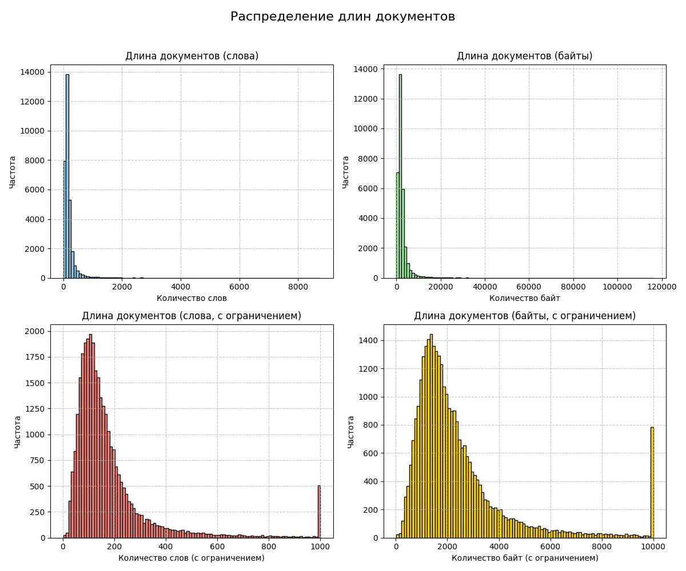

# Отчет по Лабораторной 2 - Обработка коллекции.

## Задачи
В данном отчете представлены результаты выполнения задания по обработке, анализу и морфологической обработке коллекции новостей.

---

## 1. Извлечение документов
- **Обработка файлов:**
  - Декодированы и распакованы 3 файла из архива `.bz2`: 
    - `news-shevard.xml.xml`
    - `news-080404.xml.xml`
    - `news-vybory.xml.xml`.
  - Для декомпрессии использовалась библиотека `bz2`.
  - Содержимое файлов и ссылки были декодированы из Base64 и CP1251.
  - **Итог:** обработано **31,641 документ**.

---

## 2. Очистка данных
- **Удаление HTML-разметки:**
  - Для очистки текста новостей использовалась библиотека `BeautifulSoup`.
  - HTML-разметка успешно удалена из всех документов.

- **Результат:**
  - Чистый текст сохранен в колонке `content` для дальнейшей обработки.

---

## 3. Анализ коллекции
### Статистика длины документов:
- Средняя длина документа:
  - **193 слова**
  - **2,642 байта**
- Распределение длин документов визуализировано с использованием библиотеки `matplotlib`. Графики показывают распределение в словах и байтах, включая усеченные версии.



### Доля стоп-слов:
- Средняя доля стоп-слов в коллекции составила **23.2%**.

### Средняя длина слова:
- Средняя длина слова в текстах коллекции составила **6.62 символа**.

### Доля слов, написанных латиницей:
- В коллекции латиницей написано **0.68% слов**, что говорит о преобладании кириллического текста.

### Соотношение объема текста и исходного HTML-документа:
- Тексты в среднем короче исходного HTML за счет очистки разметки. Средний объем текста — 2,642 байта.

---

## 4. Морфологическая обработка
- **Приведение к нижнему регистру:**
  - Все тексты были переведены в нижний регистр.

- **Лемматизация:**
  - Выполнена лемматизация двумя инструментами:
    - `Mystem`: лемматизированные тексты сохранены в колонке `mystem`.
    - `Pymorphy`: лемматизированные тексты сохранены в колонке `pymorphy`.
  - Результаты лемматизации обоих инструментов были сопоставлены:
    - `Mystem` работает быстрее на больших объемах текста.
    - `Pymorphy` лучше анализирует контекст.

---

## 5. Анализ словарного состава
- **Доля стоп-слов:**
  - В среднем стоп-слова составляют **23.2%** текста.

- **Средняя длина слова:**
  - Средняя длина слова в коллекции составляет **6.62 символа**.

- **Доля латинских слов:**
  - **0.68% слов** написаны латиницей.

---

## 6. Сравнительный анализ
### Распределение документов по времени:
- Файлы представляют данные за разные периоды:
  - `news-shevard.xml.xml`: Новости о Шеварднадзе.
  - `news-080404.xml.xml`: Новости от 8 апреля 2004 года.
  - `news-vybory.xml.xml`: Новости о выборах.
- Наиболее длинные тексты наблюдаются в выборной тематике.

### Популярные темы новостей:
- Для каждой темы был построен тематический анализ с использованием модели LDA.
- Выявлено 10 ключевых тем:
  1. Экономика, компании и акции (например, "компания", "оао", "рубль").
  2. Выборы и избирательные кампании (например, "выборы", "избиратель", "голос").
  3. Спортивные события и команды.
  4. Политика, включая губернаторские выборы.
  5. Новости на международной арене.

### Пример тем:
- **Тема 5 (выборы):**
  - Основные слова: "выборы", "партия", "избиратель".
  - Наиболее релевантные документы связаны с голосованием и избирательной активностью.

### Примеры найденных документов по запросу "выборы":
1. Документ о выборах в Государственную думу:
    ```
    В России проходит голосование на выборах в Государственную думу.
    По данным Центральной избирательной комиссии, к 14 часам по московскому времени активность избирателей составила около 33%.
    ```
2. Документ о выборах мэра Москвы:
    ```
    В нескольких регионах сегодня проходят губернаторские выборы, в Москве — выборы мэра.
    ```

---

## Выводы
1. **Объем данных:**
   - В коллекции содержится большое количество текстов (31,641 документ), что позволяет провести глубокий анализ.
   
2. **Качество текста:**
   - После очистки от HTML и лемматизации данные готовы для дальнейшего использования в NLP-задачах.

3. **Темы и специфики:**
   - Тематика новостей охватывает выборы, политику, экономику и спортивные события.
   - Документы с выборной тематикой выделяются длиной и высокой релевантностью для LDA.

4. **Рекомендации:**
   - Лемматизацию `Mystem` можно использовать для быстрой обработки больших объемов текста.
   - Для анализа контекста предпочтительнее использовать `Pymorphy`.

---

## Ссылки на код
Код полностью предоставлен выше, включает все этапы: извлечение, очистка, анализ, морфологическая обработка и тематическое моделирование.


## Результат выполнения кода

Processing file: news-080404.xml.xml
Processing file: news-vybory.xml.xml
Processed 31641 documents.
Средняя длина документа в словах: 193.0534749217787
Средняя длина документа в байтах: 2641.854713820676
Средняя доля стоп-слов: 0.23211303642297
Средняя длина слова: 6.6214239523207095
Доля слов, написанных латиницей: 0.006833944125613615
Тема 0: 0.042*"в" + 0.032*"и" + 0.016*"на" + 0.014*"компания" + 0.014*"по" + 0.012*"россия" + 0.011*"с" + 0.008*"быть" + 0.008*"российский" + 0.008*"оао"
Тема 1: 0.055*"в" + 0.053*"на" + 0.035*"год" + 0.019*"по" + 0.016*"составлять" + 0.016*"за" + 0.015*"млн" + 0.014*"и" + 0.014*"рубль" + 0.013*"с"
Тема 2: 0.060*"в" + 0.018*"на" + 0.016*"и" + 0.011*"по" + 0.010*"с" + 0.008*"из" + 0.007*"команда" + 0.006*"россия" + 0.006*"военный" + 0.006*"матч"
Тема 3: 0.020*"птица" + 0.014*"адыгея" + 0.012*"монета" + 0.007*"кровь" + 0.006*"пуликовский" + 0.004*"мошенник" + 0.003*"двфо" + 0.003*"переливание" + 0.003*"совмен" + 0.003*"развешивать"
Тема 4: 0.055*"в" + 0.022*"и" + 0.020*"что" + 0.014*"с" + 0.013*"по" + 0.013*"быть" + 0.012*"не" + 0.011*"на" + 0.010*"президент" + 0.010*"о"
Тема 5: 0.054*"в" + 0.029*"выборы" + 0.026*"на" + 0.025*"по" + 0.021*"избирательный" + 0.020*"партия" + 0.018*"избиратель" + 0.016*"округ" + 0.016*"россия" + 0.012*"голос"
Тема 6: 0.058*"в" + 0.039*"и" + 0.011*"по" + 0.011*"год" + 0.011*"область" + 0.010*"на" + 0.008*"с" + 0.008*"быть" + 0.007*"декабрь" + 0.006*"из"
Тема 7: 0.035*"и" + 0.031*"в" + 0.025*"не" + 0.019*"что" + 0.017*"на" + 0.015*"быть" + 0.011*"с" + 0.010*"то" + 0.010*"он" + 0.010*"это"
Тема 8: 0.067*"в" + 0.025*"на" + 0.021*"и" + 0.018*"по" + 0.013*"быть" + 0.012*"сообщать" + 0.010*"с" + 0.008*"из" + 0.008*"человек" + 0.008*"как"
Тема 9: 0.040*"в" + 0.026*"и" + 0.023*"на" + 0.018*"по" + 0.012*"быть" + 0.010*"год" + 0.009*"с" + 0.009*"область" + 0.008*"о" + 0.008*"бюджет"

Searching for 'выборы':
Документ ID: 23668, Сходство: 0.49234168700937686
В России проходит голосование на выборах в Государственную думу В России проходит голосование на выборах в Государственную думу.
По данным Центральной избирательной комиссии, к 14 часам по московскому времени активность избирателей в среднем по России составила около 33 процентов - несколько ниже, чем на прошлых парламентских выборах.
В большинстве регионов выборы можно считать состоявшимися - явка превысила 25 процентов.
На Дальнем Востоке голосование завершилось.
В наблюдательный совет по контролю за выборами поступило свыше 300 сообщений о нарушениях, среди которых - незаконная агитация и препятствование работе наблюдателей.
В нескольких регионах сегодня проходят губернаторские выборы, в Москве - выборы мэра.

Документ ID: 23667, Сходство: 0.49156151126207226
В России проходит голосование на выборах в Государственную думу В России проходит голосование на выборах в Государственную думу.
По данным Центральной избирательной комиссии, к 13 часам по московскому времени активность избирателей в среднем по России составила 14 с половиной процента - несколько выше, чем на прошлых парламентских выборах.
Во многих регионах выборы можно считать состоявшимися - явка превысила 25 процентов.
На Дальнем Востоке голосование завершилось.
В наблюдательный совет по контролю за выборами поступило свыше 300 сообщений о нарушениях, среди которых - незаконная агитация и препятствование работе наблюдателей.
В нескольких регионах сегодня проходят губернаторские выборы, в Москве - выборы мэра.

Документ ID: 23595, Сходство: 0.45716704277401216
Выборы в Эвенкии признаны состоявшимися 7 декабря в Эвенкийском округе состоялись выборы депутатов в Госдуму.
По состоянию на 14:00 по местному времени в выборах приняли участие 29,57% избирателей, сообщает "Kommersant.ru".
Представители окружной избирательной комиссии заявили, что таким образом выборы считаются состоявшимися.